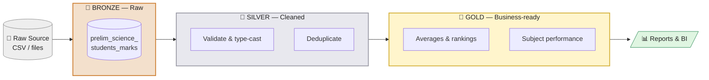
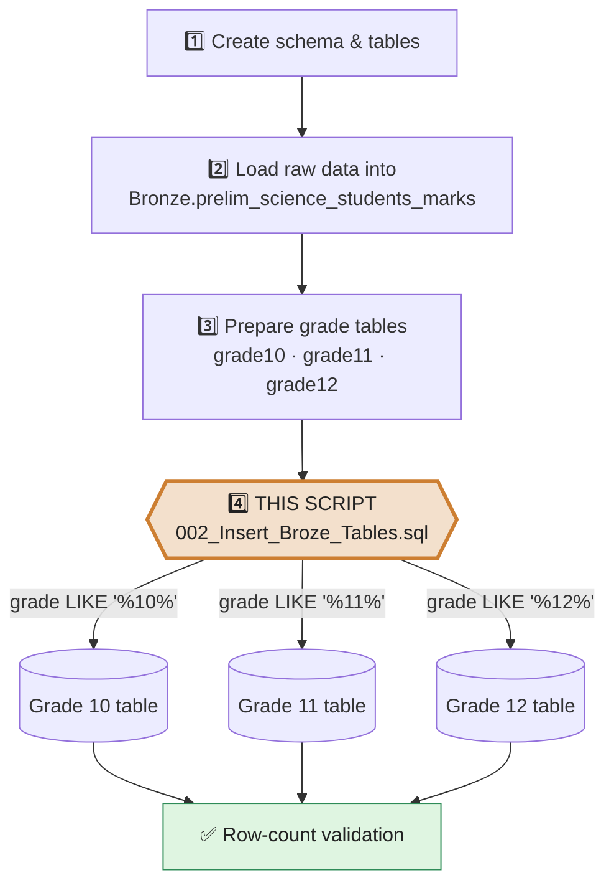
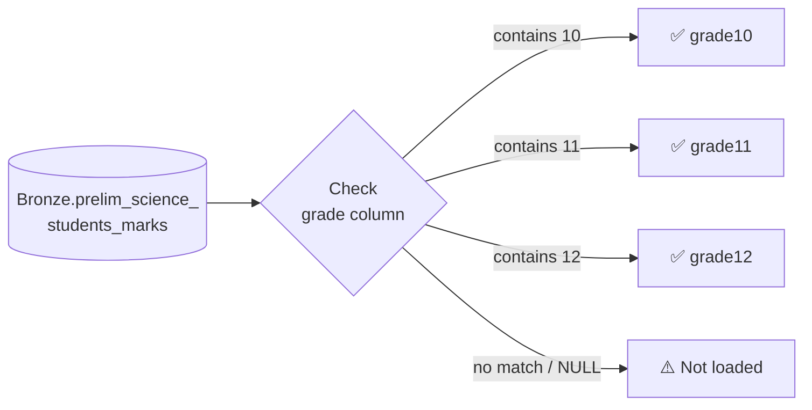

<div align="center">

# 🥉 Bronze Layer — Preliminary Science Marks

**Splits raw student marks into one table per grade (10 · 11 · 12)**


</div>

---

## 📑 Table of Contents

- [Overview](#-overview)
- [Medallion Architecture](#-medallion-architecture)
- [ETL Pipeline](#-etl-pipeline)
- [Grade Routing](#-grade-routing)
- [Columns Loaded](#-columns-loaded)
- [Prerequisites](#-prerequisites)
- [How to Run](#-how-to-run)
- [Validation](#-validation)
- [Notes and Caveats](#-notes-and-caveats)
- [Roadmap](#-roadmap)

---

## 🔎 Overview

**Script:** `002_Insert_Broze_Tables.sql`

This script is **step 4** of the Bronze load. It copies rows from one source table into three grade-specific tables, using the `grade` column to decide where each row goes.

| 🎓 Grade | 🎯 Target table | 🔍 Filter |
|:-------:|-----------------|-----------|
| **10** | `Bronze.prelim_science_students_marks_grade10` | `grade LIKE '%10%'` |
| **11** | `Bronze.prelim_science_students_marks_grade11` | `grade LIKE '%11%'` |
| **12** | `Bronze.prelim_science_students_marks_grade12` | `grade LIKE '%12%'` |

📥 **Source table:** `Bronze.prelim_science_students_marks`

---

## 🏅 Medallion Architecture

The project follows the **medallion** pattern: data moves through progressively cleaner layers.



> ℹ️ **This repository script covers the Bronze layer only.** Silver and Gold are shown to give context; they are planned next steps (see [Roadmap](#-roadmap)).

---

## 🔄 ETL Pipeline

What happens inside the Bronze layer, step by step:



> Steps 1–3 are inferred from the script's numbering ("4.") and its prerequisites.

---

## 🧭 Grade Routing



---

## 🧾 Columns Loaded

All three inserts use the same column list.

| # | Column | Description |
|:-:|--------|-------------|
| 1 | `student_id` | Unique identifier for the student |
| 2 | `student_name` | Student's name |
| 3 | `grade` | Grade label (e.g. 10, 11, 12) |
| 4 | `mathematics_mark` | Mathematics |
| 5 | `physical_science_mark` | Physical Science |
| 6 | `life_sciences_mark` | Life Sciences |
| 7 | `english_home_language_mark` | English Home Language |
| 8 | `life_orientation_mark` | Life Orientation |
| 9 | `information_technology_mark` | Information Technology |
| 10 | `agricultural_science_mark` | Agricultural Science |
| 11 | `total_mark` | Total of the student's marks |
| 12 | `average_mark` | Average of the student's marks |

> 💡 Columns are listed explicitly in both `INSERT` and `SELECT` (not `SELECT *`), so the load still works if the source column order changes.

---

## ✅ Prerequisites

- [ ] The `Bronze` schema exists
- [ ] `Bronze.prelim_science_students_marks` exists and is populated
- [ ] The three target tables exist with the columns above

---

## ▶️ How to Run

1. Confirm the prerequisites above.
2. Run `002_Insert_Broze_Tables.sql` against the target database.
3. Check row counts (see below).

---

## 🧪 Validation

Compare the source count with the three target counts:

```sql
SELECT COUNT(*) AS source_rows
FROM   Bronze.prelim_science_students_marks;

SELECT
    (SELECT COUNT(*) FROM Bronze.prelim_science_students_marks_grade10) AS grade10_rows,
    (SELECT COUNT(*) FROM Bronze.prelim_science_students_marks_grade11) AS grade11_rows,
    (SELECT COUNT(*) FROM Bronze.prelim_science_students_marks_grade12) AS grade12_rows;
```

If the totals don't match, some rows have a `grade` value that doesn't contain 10, 11 or 12, or is `NULL`.

---

## ⚠️ Notes and Caveats

| | Note |
|:-:|------|
| 🔁 | **Not idempotent.** The script only inserts; running it twice duplicates rows unless the targets are truncated first. |
| 🔤 | **Pattern matching.** `LIKE '%10%'` matches any value containing those digits (e.g. `110` would match). Use an exact match if `grade` data is not clean. |
| 🚫 | **Unmatched rows** (no 10/11/12 in `grade`) are not loaded anywhere. |
| 🧱 | **No cleaning.** This is a straight copy, in line with Bronze holding raw data. |

---

## 🗺️ Roadmap

- [x] Bronze: split raw marks by grade
- [ ] Add `TRUNCATE` (or a load-log) to make the load re-runnable
- [ ] Silver: validate marks (0–100), cast types, remove duplicates
- [ ] Gold: per-grade averages, subject rankings, pass rates
- [ ] Connect Gold to a BI dashboard